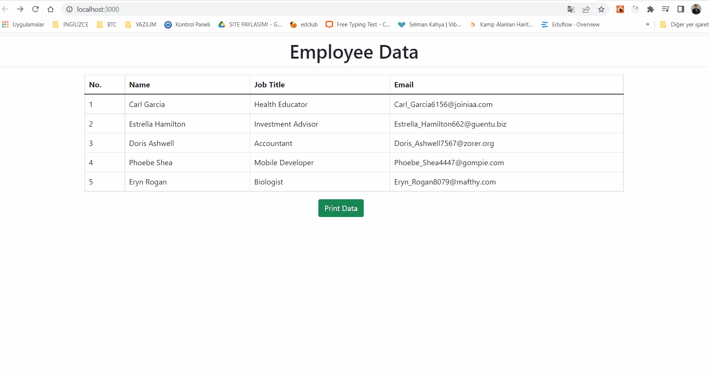

# React to Pdf Printing
### [Live Site](https://enes9103.github.io/React_To_Pdf_Printing/)

## About the project
React to Pdf Printing project is an application that provides output by converting data inputs prepared with React.js into pdf format.

<!-- DESCRIPTION -->
## Description
- The application is designed as a Single Page.
- Data are entered through codes. However, it can also be designed to allow user input.
- The project was prepared with React.js.
- React Bootstrap and Bootstrap are used for style operations.
    'npm install react-bootstrap bootstrap'
- React-to-print is used for formatting printing operations.
    'npm install --save react-to-print'
- The application can work responsively on mobile and desktop platforms.

<!-- PROJECT OUTCOME -->
## Project Outcome


<p align="right">(<a href="#top">back to top</a>)</p>

<!-- GETTING STARTED -->
## Getting Started

This is an example of how you may give instructions on setting up your project locally.
To get a local copy up and running follow these simple example steps.

### Prerequisites

This is an example of how to list things you need to use the software and how to install them.
* npm
  ```sh
  npm install npm@latest -g
  ```

### Installation

_Following is an example of how you can instruct your audience to install and set up your app. This template is not based on any external dependencies or services._
1. Clone the repo
   ```sh
   git clone https://github.com/enes9103/React_Restaurant_ui_ux_Design
   ```
2. Install NPM packages
   ```sh
   npm install
   ```

3. The project is ready, you can start using it immediately.
    You can run:

    `start npm`

4. Runs the application in development mode.\
    Open [http://localhost:3000](http://localhost:3000) to view in the browser.

<p align="right">(<a href="#top">back to top</a>)</p>

<!-- CONTRIBUTING -->
## Contribution

Contributions are what make the open source community a great place to learn, inspire and build. Your contributions are **highly appreciated**.

If you have a suggestion to make this better, please fork the repo and create a pull request. You can also open an issue with the "development" tag.
Don't forget to give stars to the project! Thanks again!

1. Fork the Project
2. Create your Feature Branch (`git checkout -b feature/AmazingFeature`)
3. Make Your Changes (`git commit -m 'Add some AmazingFeature'')
4. Branch to the Branch (`git push origin feature/AmazingFeature`)
5. Open a Pull Request

<p align="right">(<a href="#top">back to top</a>)</p>


<!-- CONTACT -->
## Contact

<a href="https://my-portfolio-page-resume.herokuapp.com/">

</a>

<a href="https://www.linkedin.com/in/enesunlu/">

</a>

<a href="https://twitter.com/Enes9103">

</a>

<a href="https://www.instagram.com/enesunlu0303/">

</a>

<a href="https://t.me/Enes9103">

</a>

<a href="mailto:enes9103@gmail.com">

</a>

Project Link: [https://github.com/enes9103](https://github.com/enes9103)
</p>


<!-- SUPPORT -->
## Support

<p><a href="https://www.buymeacoffee.com/enes9103"> </a>

 <p align="right">(<a href="#top">back to top</a>)</p>
